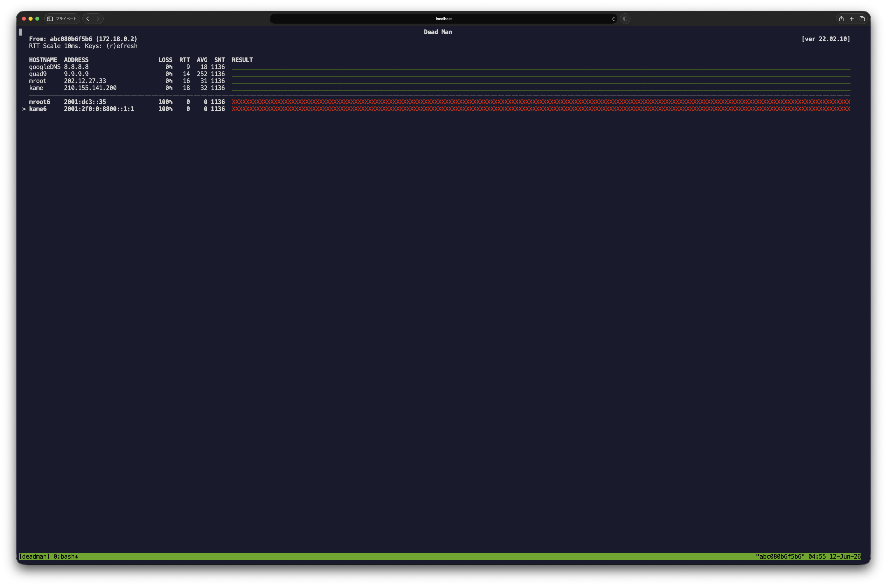

# ttyd-deadman

[deadman](https://github.com/upa/deadman) を ttyd 経由でブラウザから閲覧専用で配信する Docker 構成です。
NOC部屋のサーバで動かし、会場スタッフがスマホ・ノートPCのブラウザから状態を確認できます。

## 構成

```
[deadman] → tmux セッション内で起動
    ↓
[ttyd]    → read-only でブラウザに配信
    ↓
http://localhost:7681 でスタッフが閲覧
```

## スクリーンショット



緑のバーが応答中のホスト、赤の `x` が無応答のホストを示します。
ttyd 経由でブラウザからそのまま確認できます。

## 使い方

### 1. deadman バイナリを配置

```bash
# ビルド済みバイナリをこのディレクトリに置く
cp /path/to/deadman ./deadman
```

### 2. deadman の設定ファイルを用意

```bash
cp /path/to/your/deadman.conf ./deadman.conf
```

### 3. 起動

```bash
docker compose up -d
```

### 4. アクセス確認

```
http://localhost:7681
```

## 注意点

### ping に NET_RAW が必要

ICMP (ping) は Docker コンテナ内では `CAP_NET_RAW` が必要です。
docker-compose.yml に `cap_add: [NET_RAW]` が入っています。

セキュリティポリシー上 cap_add が使えない環境では:

- `network_mode: host` に切り替える
- ping の代わりに TCP/QUIC での監視にする

### 管理ネットワーク外には公開しない

ttyd は HTTP で配信されるため、NOC用の管理 VLAN 内からのみアクセスできるように
ファイアウォールまたは nginx のアクセス制限を入れることを推奨します。

```nginx
# nginx での例
location / {
    proxy_pass http://localhost:7681;
    allow 192.168.0.0/24;  # NOC セグメントのみ
    deny all;
}
```

### Basic認証をかける場合

docker-compose.yml の環境変数を有効にします:

```yaml
environment:
  TTYD_CREDENTIAL: "noc:yourpassword"
```

## サイネージ用途（会場モニター）

Raspberry Pi + Chromium でキオスク表示する場合:

```bash
chromium-browser \
  --kiosk \
  --noerrdialogs \
  --disable-infobars \
  "http://localhost:7681"
```

## ライセンス

MIT

本プロジェクトは [deadman](https://github.com/upa/deadman)（作者: upa@haeena.net）を改変したものです。
元のソフトウェアは MIT License のもとで配布されています。

```
MIT License

Copyright (c) upa@haeena.net

Permission is hereby granted, free of charge, to any person obtaining a copy
of this software and associated documentation files (the "Software"), to deal
in the Software without restriction, including without limitation the rights
to use, copy, modify, merge, publish, distribute, sublicense, and/or sell
copies of the Software, and to permit persons to whom the Software is
furnished to do so, subject to the following conditions:

The above copyright notice and this permission notice shall be included in all
copies or substantial portions of the Software.

THE SOFTWARE IS PROVIDED "AS IS", WITHOUT WARRANTY OF ANY KIND, EXPRESS OR
IMPLIED, INCLUDING BUT NOT LIMITED TO THE WARRANTIES OF MERCHANTABILITY,
FITNESS FOR A PARTICULAR PURPOSE AND NONINFRINGEMENT. IN NO EVENT SHALL THE
AUTHORS OR COPYRIGHT HOLDERS BE LIABLE FOR ANY CLAIM, DAMAGES OR OTHER
LIABILITY, WHETHER IN AN ACTION OF CONTRACT, TORT OR OTHERWISE, ARISING FROM,
OUT OF OR IN CONNECTION WITH THE SOFTWARE OR THE USE OR OTHER DEALINGS IN THE
SOFTWARE.
```
